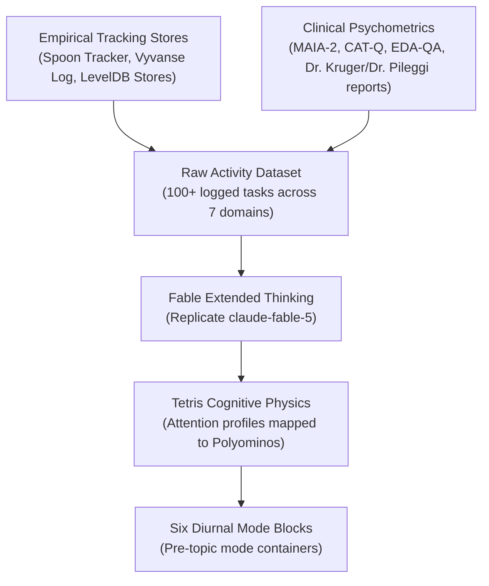
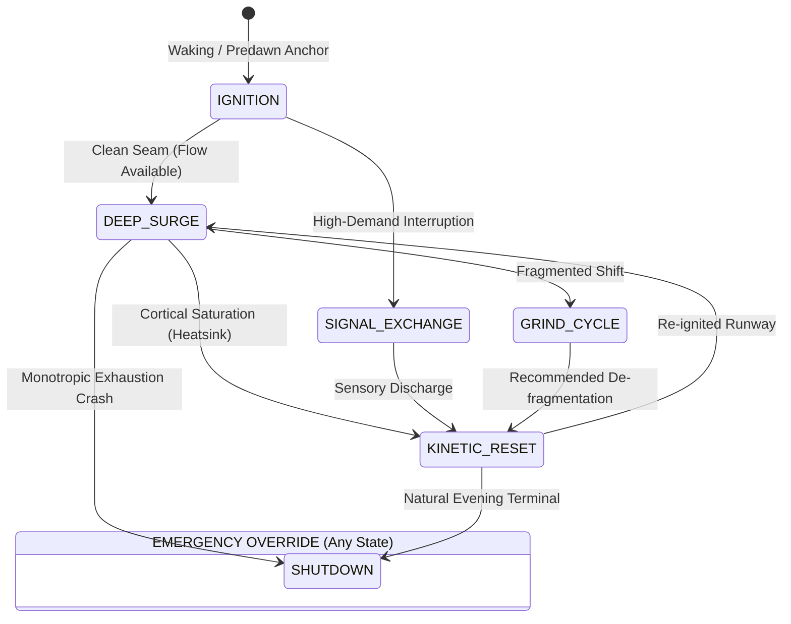

# The Six Diurnal Cognitive Mode Blocks: Geometry, Genesis & Non-Deterministic Flow

## KICKER
PK-DIURNAL-001 // COGNITIVE GEOMETRY & MODE TOPOLOGY

> [!IMPORTANT]
> **TETRIS COGNITIVE GEOMETRY TRILOGY · PART 1 OF 3**  
> This specification documents the **macro diurnal mode architecture** and non-deterministic state dynamics. It establishes the baseline mode-container paradigm that is decomposed into the 13 specific topic polyominos in **[Part 2: Topic-Based Tetris Mode Containers](/topic-tetris-blocks/)**, and deeply analyzed via frontier reasoning in **[Part 3: Fable's Cognitive Geometric Rationales](/topic-tetris-shape-geometry/)**.

> **Origin**: Synthesized on 2026-09-03 in Session [`5bd03b9d`](conversation://5bd03b9d-0daf-4610-a7ac-5493df1be565) via Claude Extended Thinking (Fable) from longitudinal tracking stores and clinical neuropsychological evaluations.  
> **Core Thesis**: Time is not fungible slot-space. Diurnal capacity is **mode-space**—and cognitive modes possess physical geometry with distinct attention tunnels, entry costs, and seam friction.

---

## 01. How the Blocks Were Created

The Six Mode Blocks emerged from a multi-stage data distillation pipeline combining empirical tracking data, clinical psychometrics, and frontier reasoning:



1. **Longitudinal Ground Truth**:
   - Ingested 18 days of continuous telemetry (2026-07-27 to 2026-08-13): 17 logged Vyvanse doses, 85 activity checkpoints, and 11 zero-spoon crash events.
   - Evaluated somatic markers: 61.5% jaw tension prevalence, 58.6% stimulant appetite suppression, and clustered afternoon exhaustion windows (14:30–15:30).
2. **Clinical Boundary Conditions**:
   - **MAIA-2 (0–5th percentile)**: Interoception floor; biological cues cannot guide transitions.
   - **EDA-QA (96.7th percentile)**: High demand-avoidance threat response when tasks carry coercive framing.
   - **CAT-Q (137)**: Extreme camouflaging/masking overhead during social contact.
3. **Fable Reasoning Dispatch**:
   - Flat activities (`bryce_activities_raw.csv`) were passed to Fable with a strict design brief: *reject uniform 30-minute time slots; group activities into incompatible Tetris-like geometric mode-containers where gaps represent context-switching taxes*.
   - Fable clustered the 100+ tasks into 6 canonical polyominos based on cognitive continuity, activation energy, and re-entry costs.

---

## 2. The Six Diurnal Mode Blocks Explained

```
   [Block 01: L-Block]      [Block 02: I-Block]       [Block 03: T-Block]
        ██                       ██                        ██
        ██                       ██                      ██████
        ██                       ██                        
        ████                     ██                        
     (Ignition)              (Deep Surge)            (Signal Exchange)

   [Block 04: S/Z-Block]    [Block 05: J-Block]       [Block 06: O-Block]
          ████                     ██                      ████
        ████                       ██                      ████
                                 ████                      
     (Grind Cycle)          (Kinetic Reset)             (Shutdown)
```

### Block 01: IGNITION
- **Shape Archetype**: **L-Block** (Long vertical spine with one horizontal foot).
- **Cognitive Profile**: Low-decision boot sequence. Linear, deterministic progression anchored by a single load-bearing chemical event.
- **Load-Bearing Anchor**: Medication administration (Vyvanse 50mg, predawn median ~04:30). If the foot is skipped or delayed, the entire day's coordinate grid shifts.
- **Constituent Tasks**:
  - Morning waking protocol and early rising sequence.
  - Somatic check-ins (jaw tension, resting heart rate, sleep quality, night sweats).
  - Skincare, grounding, weight tracking, anxiety down-regulation.
  - Solitary outdoor walk in low-stimulation lighting, dog walk with Sam/Theo, coffee pickup.
- **Docking Property**: Flush under the I-Block. This represents the **only seamless transition** in the entire cognitive topology.

---

### Block 02: DEEP SURGE
- **Shape Archetype**: **I-Block** (Monolithic $4 \times 1$ straight line; zero branches, zero notches).
- **Cognitive Profile**: Unbroken monotropic hyperfocus tunnel. Maximum productive output and maximum catastrophic fragility.
- **Vulnerability**: Cannot be paused, rotated, or bent. An external interruption does not suspend the piece—it shatters it, destroying the remaining runway.
- **Constituent Tasks**:
  - Client course build authoring, LMS upload, and curriculum mapping (Excel Education, LearnStage, Step Design, Bryte AI).
  - Deep instructional design authoring with noise-canceling earphones.
  - Creative fiction writing (*Wat sê jy, Mariaan?*), digital artifact construction, prompt engineering.
  - High-flow coding sprints and systems architecture.
- **Pathological Seam**: Hyperfocus trap—the inability to disengage when physiological or boundary limits are reached.

---

### Block 03: SIGNAL EXCHANGE
- **Shape Archetype**: **T-Block** (Central stem with three outward-facing lateral branches).
- **Cognitive Profile**: Divergent, multi-branch communication. The exact inverse of monotropism; requires attention to fan out across multiple concurrent entities.
- **Cognitive Tax**: Extreme context-switching drag. High masking demand and anticipatory fuzz.
- **Constituent Tasks**:
  - Client kickoffs, onboarding Q&A, milestone reviews, live strategy syncs.
  - Co-founder operational check-ins with Andrew (The ONmedia Collective / ND Agency).
  - Upwork proposal feed triage, inbox filtering, VA coordination.
  - Outbound partnership inquiries, commercial space leasing queries, newsletter dispatches.
- **Seam Collision**: **Structurally hostile to the I-Block**. Transitioning directly from Deep Surge (I) into Signal Exchange (T) leaves a 2-cell air gap: the cognitive tunnel cannot release instantaneously.

---

### Block 04: GRIND CYCLE
- **Shape Archetype**: **S/Z-Block** (Jagged, discontinuous half-cell offsets).
- **Cognitive Profile**: Fragmented, low-coherence administrative maintenance and physical-world bureaucracy. Low autonomy, high executive friction.
- **Locus of Failure**: Where executive dysfunction, decision paralysis, and energy drains concentrate in the tracking dataset.
- **Constituent Tasks**:
  - Personal finance, SARS tax filing, Bank Zero/FICA reconciliation, subscription management, utility invoices.
  - Errand runs, household maintenance, contractor supervision (Kimon), pet memorial tasks (Eva ashes collection).
  - Grocery staging (Sixty60 list coordination).
- **Physics**: The jagged boundary generates internal shear. Stacking two S/Z blocks together without an intermediary buffer causes immediate state collapse.

---

### Block 05: KINETIC RESET
- **Shape Archetype**: **J-Block** (Vertical motor spine with an upturned catching hook).
- **Cognitive Profile**: Somatic discharge. Bypasses prefrontal cognition to convert residual cortical and nervous system charge into physical motor output.
- **Neutralizing Function**: Physical exertion acts as an active heatsink for cognitive overload.
- **Constituent Tasks**:
  - SSISA resistance training, independent weightlifting, conditioning, swimming.
  - Solo gym routines with noise-canceling headphones.
  - Extended recovery walking at De Waal Park; sensory decompression strolls.
  - Therapeutic bodywork and somatic tension release.
- **Docking Property**: Uniquely equipped to dock against the jagged edge of the Grind Cycle (S/Z). Physical exertion absorbs and resets administrative fragmentation far more effectively than passive rest.

---

### Block 06: SHUTDOWN / RECOVERY
- **Shape Archetype**: **O-Block** (Sealed $2 \times 2$ solid square; no notches, no docking teeth).
- **Cognitive Profile**: Terminal down-regulation, biological preservation, and non-demanding restoration.
- **Emergency Override Behavior**: Unlike other pieces that wait for their turn in the stack, **the O-Block drops unconditionally out of sequence** when a Zero-Spoon Depletion event occurs. It falls directly on top of whatever block is active, halting execution.
- **Constituent Tasks**:
  - Quiet dinner, sensory darkness, screen-time browsing, resting with Eva/Sam.
  - AuDHD decompression, non-verbal quiet time, communicative reset.
  - Low-demand tactile craft (loom knitting, simple sketching, t-shirt printing).
  - Grief processing and emotional grounding.
- **Docking Property**: Autonomous and impenetrable. Nothing docks into it, and nothing branches out from it.

---

## 3. The Non-Deterministic Operating Model

Traditional calendars assume **deterministic slot-space**: 
$$\text{Day} = \text{Slot}_1 (08:00) \to \text{Slot}_2 (10:00) \to \text{Slot}_3 (12:00) \dots$$

This system rejects that paradigm. The Six Mode Blocks operate under a **non-deterministic, dynamic field model**:



### Key Non-Deterministic Dynamics:

1. **No Fixed Timetable**:
   - The blocks do **not** dictate hours (e.g. "Grind Cycle must run at 14:30"). If energy dips early or administrative tasks are light, Grind Cycle is entirely omitted or replaced by a Kinetic Reset.
2. **Dynamic Entry & State Transitions**:
   - Transition feasibility depends on **contact surface compatibility**, not clock time:
     - **Permitted Low-Cost Transition**: `IGNITION (L)` $\to$ `DEEP_SURGE (I)` (flush docking seam).
     - **High-Cost Transition**: `DEEP_SURGE (I)` $\to$ `SIGNAL_EXCHANGE (T)` (requires an explicit air-gap buffer or de-escalation ramp).
     - **Discharge Transition**: `GRIND_CYCLE (S/Z)` $\to$ `KINETIC_RESET (J)` (mechanical hook clears fragmentation).
3. **Emergency Preemption (The Zero-Spoon Drop)**:
   - When internal or environmental load exceeds tolerance, `SHUTDOWN (O)` activates instantaneously. It does not negotiate with scheduled commitments.
4. **Rogue Pieces (Social Masking Multipliers)**:
   - External social obligations (family events, long client lunches, multi-party meetings) are **untyped rogue polyominos**. They spawn unpredictably, cannot be predicted by fixed schedules, and consume $2\times$ to $3\times$ their nominal grid footprint in recovery buffer.
5. **Emergent Daily Topologies**:
   - Depending on lived energy tokens and external friction, a single day may resolve as:
     - *Pure Monotropic Run*: `IGNITION` $\to$ `DEEP_SURGE` $\to$ `KINETIC_RESET` $\to$ `SHUTDOWN`
     - *Admin & Logistics Run*: `IGNITION` $\to$ `SIGNAL_EXCHANGE` $\to$ `GRIND_CYCLE` $\to$ `KINETIC_RESET` $\to$ `SHUTDOWN`
     - *Low-Capacity Recovery Run*: `IGNITION` $\to$ `KINETIC_RESET` $\to$ `SHUTDOWN (Override)`

---

## 4. Architectural Summary

| Block | Shape | Role | Seam Friction with I-Block |
| :--- | :--- | :--- | :--- |
| **01 IGNITION** | **L-Block** | Predictable boot sequence & Vyvanse anchor | **0 (Flush Dock)** |
| **02 DEEP SURGE** | **I-Block** | Monotropic hyperfocus & deep creative build | **N/A (Anchor)** |
| **03 SIGNAL EXCHANGE** | **T-Block** | Multi-branch outward communication & triage | **High (2-cell air gap)** |
| **04 GRIND CYCLE** | **S/Z-Block** | Discontinuous admin, chores & physical errands | **Severe (Shear friction)** |
| **05 KINETIC RESET** | **J-Block** | Motor discharge & cortical heatsink | **Low (Absorptive seam)** |
| **06 SHUTDOWN / RECOVERY** | **O-Block** | Zero-spoon restorative containment & emergency stop | **Absolute (Overrides stack)** |
